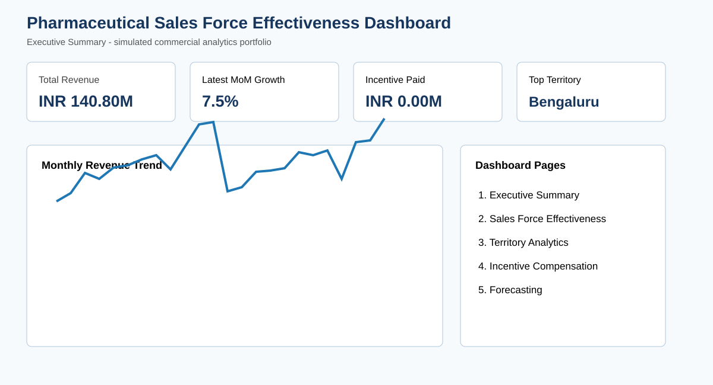

# Pharmaceutical Sales Force Effectiveness & Incentive Compensation Analytics



## Overview
End-to-end simulated pharma commercial analytics project using SQL, Python, Power BI-ready datasets, and Excel. The dataset contains **10,368 sales records**, **72 representatives**, **850 doctors**, and **8 products** across January 2024 to December 2025.

## Business Outcomes
- Total simulated revenue: **INR 140.80 million**
- Incentive compensation paid: **INR 0.00 million**
- Highest revenue territory: **Bengaluru**
- Selected forecast model: **Random Forest** based on holdout RMSE
- Next-quarter forecast: **INR 16.72 million**

## Deliverables
- Realistic synthetic dataset with 10,000+ records
- MySQL schema and recruiter-level analysis queries with joins, CTEs, window functions, rankings, KPI calculations, LAG, and rolling trends
- Python notebook for validation, EDA, correlation workflow, Linear Regression, and Random Forest forecasting
- Power BI-ready CSV files, Excel data model, DAX measures, five-page dashboard build guide, and dashboard mock-up

## Repository Structure
```text
data/       CSV datasets, forecast, model metrics
sql/        schema.sql, load_data.sql, analysis_queries.sql
notebooks/  pharma_analysis.ipynb
powerbi/    data-model workbook, DAX measures, dashboard build guide
images/     dashboard_mockup.svg
scripts/    run_forecasting.py
```

## Dashboard Pages
1. Executive Summary
2. Sales Force Effectiveness
3. Territory Analytics
4. Incentive Compensation
5. Forecasting

## Resume Project Entry
**Pharmaceutical Sales Force Effectiveness & Incentive Compensation Analytics | SQL, Python, Power BI**

Developed an end-to-end analytics solution to evaluate sales force productivity, territory performance, physician engagement, and incentive compensation for a simulated pharmaceutical organization. Built SQL-based KPI calculations and business reports using joins, window functions, and performance metrics across 10,000+ records. Created interactive Power BI dashboard specifications for executive reporting, territory analysis, sales representative effectiveness, and forecasting. Applied Python (Pandas, NumPy, Scikit-learn) for data cleaning, exploratory analysis, and predictive sales forecasting to support data-driven decision-making.

## Important Note
A genuine Power BI `.pbix` binary must be created in Power BI Desktop. This repository includes the complete import-ready data model, DAX, dashboard page specification, and mock-up rather than a fake PBIX file.

## Disclaimer
All data is synthetic. It does not include real doctors, employees, patients, or company information.
